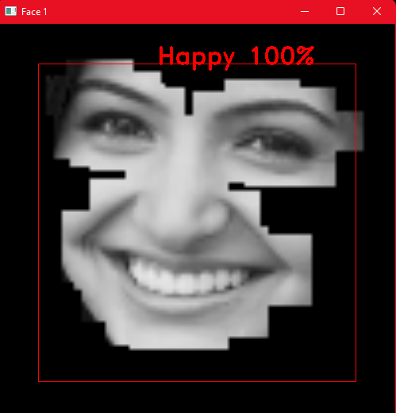
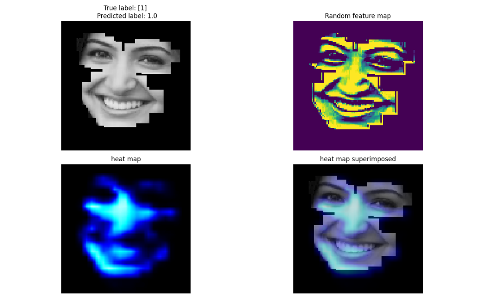
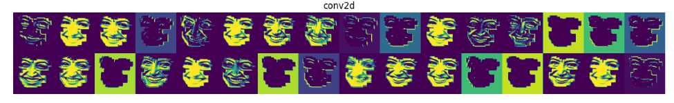
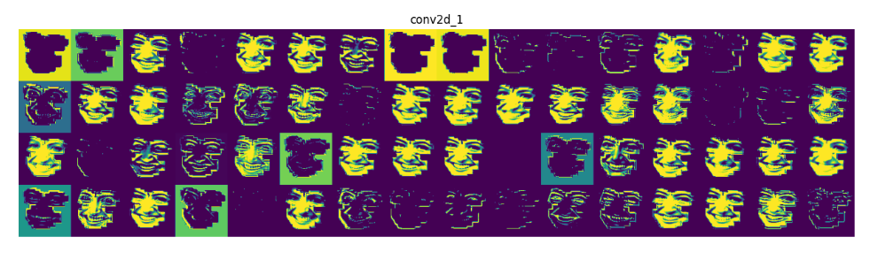
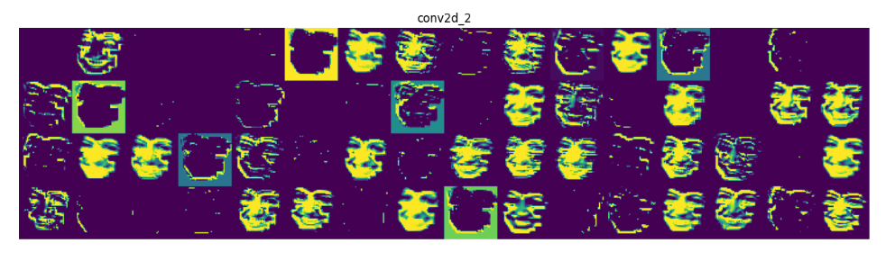
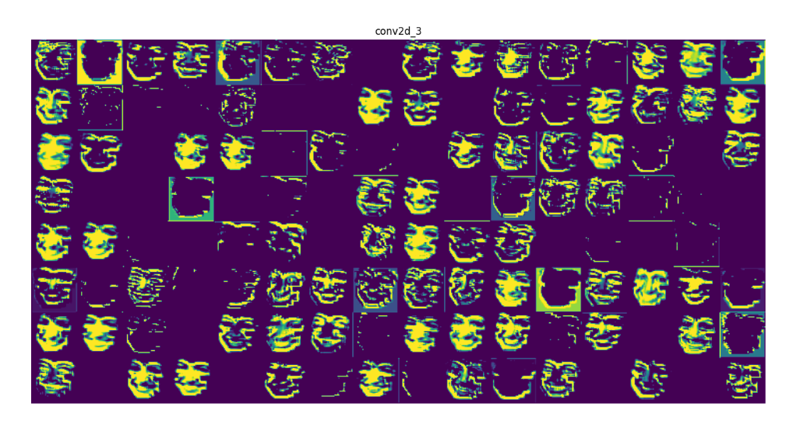

Goal of this project is to detect if a person is happy, from an image. 
- The first model(_source_) was built to detect using all landmarks of the face.
- Second model was built to detect using only the landmarks of eyes nose and mouth region.
- Third model*(_ENMimages_)* uses a combination of images of
eyes, nose and mouth and landmarks to detect happy. 

The third model(ENMimages) would be the benchmark model that comes close to the best models out there(precision of 90% on test set)

The program was tested on python 3.10.8, tensorflow 2.10.0 and was tested on windows 11 with a GTX 1080ti. It should work on other hardware and OS was well.

The project just needs a bit of cleaning which I'll get around to, eventually. It just has a bunch of unnecessary files, and code. If you want to build from this,
feel free to do so. You just have to do some cleaning. Everything works tho, so don't worry about that.

### How to run project:

1. Extract the venv.zip file if on windows and run the below commands. If on linux, install the requirements.txt file.
    - `venv\Scripts\activate`
    - Create a python virtual environment
    - If you get an error saying you are not allowed to run scripts. Run the below command.
      - `Set-ExecutionPolicy Unrestricted -Force`

2. `python setup.py`

3. cd into the source folder of your choice(Example: source_ENMimages). Then, 
   - `python Run.py`
      - Runs the live camera happy detection

3. `python RunSingle.py` 
   - This command runs the detector on the file you select from the input_files folder

4. `python Train.py`
   - You can retrain the model using this. There is a pretrained model already, but if you wish to retrain, read the article in the link below to find details on where you can get the data.
The kaggle fer2013 data is in xlsx format. You can place it in the data_<project_name> folder and the program will automatically read it.
ENMimages model requires you to place the xlsx data on both data_ENM and data_ENMimages. Preprocessing will save the preprocessed data to both these folders, as
the model will use a combination of CNN and euclidian distances of landmarks(read article to understand how this is done)
   

Below link provides details of this projects working. It describes the same algorithm detecting all emotions, but, this one focuses on just happy. 
https://medium.com/@rishiswethan.c.r/emotion-detection-using-facial-landmarks-and-deep-learning-b7f54fe551bf

Here is a video of the same algotihm using landmarks and images to make predictions

https://www.youtube.com/watch?v=H5aaYGRGxDo

#### Input and output of RunSingle.py from ENMimages:
 

#### Heatmap of RunSingle.py from ENMimages:

#### First conv layer of ENMimages:

#### Second conv layer of ENMimages:

#### Third conv layer of ENMimages:

#### Fourth conv layer of ENMimages:

#### A rough depection of the ENMimages model:

