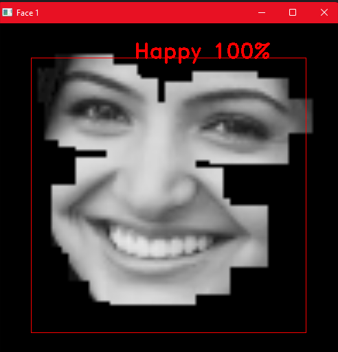
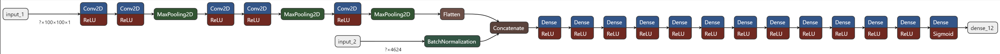

Goal of this project is emotion recognition from facial landmarks and the image itself. This project focuses on just predicting the
emotion 'happy', but it can be expanded to predict other emotions as well. This limitation was an attempt to beat the current benchmark emotion recognition
models, and I did come close. Do check it out!
- The first model(_source_) was built to detect using all landmarks of the face.
- Second model(_sourceENM_) was built to detect using only the landmarks of eyes nose and mouth region.
- Third model*(_ENMimages_)* uses a combination of images of
eyes, nose, mouth, and their landmarks to detect the emotion.

The third model(ENMimages) would be the benchmark model that came close to the best models out there(precision of 90% on test set.
Best model I saw had 91% on this dataset). It uses fer2013 dataset from kaggle. The ENMimages model concatinates the output from a CNN and the combinations
of landmark distances. It then feeds that to a deep neural network. This is a novel approach I attempted to improve the accuracy. It
already gets the landmarks of the face directly from a landmark detector(see link below), and uses the cropped images
of eyes, nose, and mouth to fill out any other information it may need, to make an accurate prediction.

The program was tested on python 3.10.8, tensorflow 2.10.0 and was tested on windows 11 with a GTX 1080ti. It should work on other hardware and OS was well.

The project may need a bit of cleaning up of comments, unused functions, etc from my experimentation. If you want to build from this,
feel free to do so. Everything works fine, so don't worry about that.

### How to run project:

1. Extract the venv.zip file if on windows and run the below commands. If on linux, skip the below commands install the requirements.txt file.
    - `venv\Scripts\activate`
    - Create a python virtual environment
    - If you get an error saying you are not allowed to run scripts. Run the below command.
      - `Set-ExecutionPolicy Unrestricted -Force`

2. `python setup.py`

3. cd into the source folder of your choice(Example: source_ENMimages). Then, 
   - `python Run.py`
      - Runs the live camera happy detection

3. `python RunSingle.py` 
   - This command runs the detector on the file you select from the input_files folder

4. `python Train.py`
   - You can retrain the model using this. There is a pretrained model already in the repo, but if you wish to retrain, read the article in the link below to find details on where you can get the data.
The kaggle fer2013 data is in xlsx format. You can place it in the data_<project_name> folder and the program will automatically read it.
ENMimages model requires you to place the xlsx data on both data_ENM and data_ENMimages. Preprocessing will save the preprocessed data to both these folders, as
the model will use a combination of CNN and euclidian distances of landmarks(read article below to understand how landmark detection is done)
   

Below link provides details of this project's working. It describes the landmarks only algorithm detecting all emotions,
but, this one focuses on just happy. The principles for landmark detection are still the same.

[https://medium.com/@rishiswethan.c.r/emotion-detection-using-facial-landmarks-and-deep-learning-b7f54fe551bf]()

Here is a video of the same algotihm using landmarks and images to make predictions

https://www.youtube.com/watch?v=H5aaYGRGxDo

#### Input and output of RunSingle.py from ENMimages:
   

#### Heatmap of RunSingle.py from ENMimages:

#### First conv layer of ENMimages:

#### Second conv layer of ENMimages:

#### Third conv layer of ENMimages:

#### Fourth conv layer of ENMimages:

#### A rough depection of the ENMimages model:
